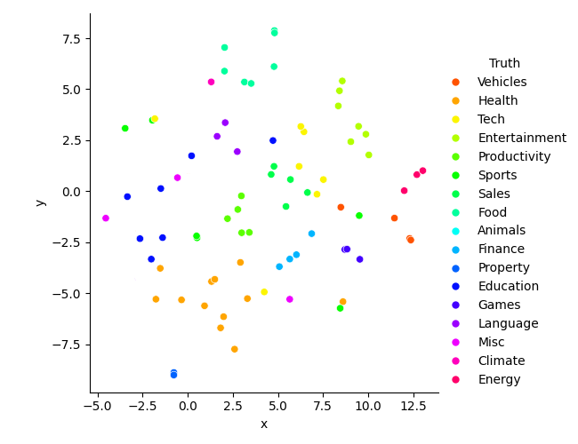
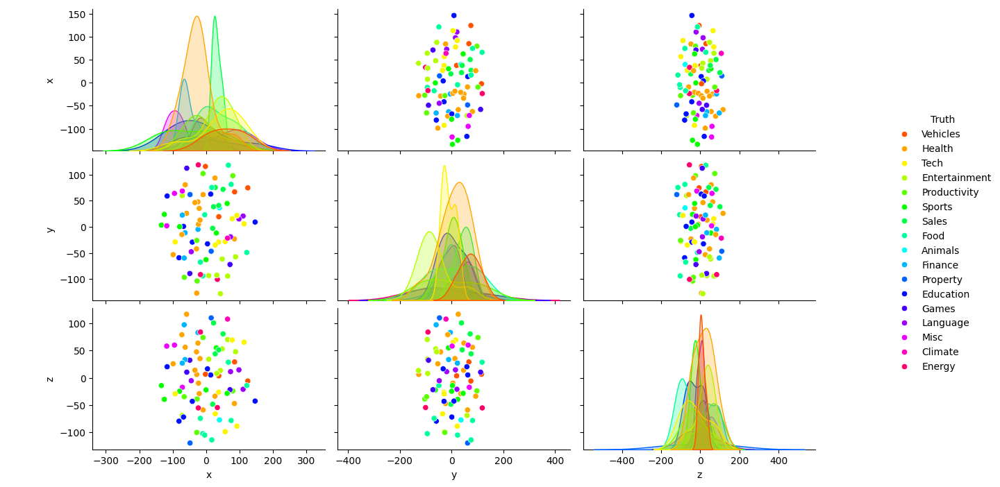

# Neural Dataset Search

This is a program to implement neural search on datasets using vector embeddings. The objective is to fetch datasets according to the given requirements.

## Features

- **Vector Embeddings**: Utilizes advanced sentence transformers to convert text data into high-dimensional vector embeddings, enabling efficient and accurate search capabilities.
- **Dimensionality Reduction**: Applies techniques like TSNE and PCA to reduce the dimensionality of embeddings, making it easier to visualize and interpret the data.
- **Visualization**: Generates various plots to help understand the data and embeddings, including:
  - **2D Scatter Plot**: Visualizes the reduced-dimensional embeddings in a 2D space.
    
  - **Heatmap**: Displays the similarity matrix of embeddings.
  - **Bar Plot**: Highlights the most relevant words based on TF-IDF scores.
  - **Pair Plot**: Shows pairwise relationships in the dataset.
    
- **TF-IDF Analysis**: Performs TF-IDF analysis to identify and visualize the most relevant words in the dataset, helping to understand the key terms and their importance.

## Installation

To get started with Neural Dataset Search, follow these steps:

1. **Clone the repository**:
    ```sh
    git clone https://github.com/AshwinDEM/NeuralDataHunt.git
    cd NeuralDataHunt
    ```

2. **Create a virtual environment**:
    ```sh
    python -m venv venv
    venv\Scripts\activate
    ```

3. **Install the required dependencies**:
    ```sh
    pip install -r requirements.txt
    ```

## Usage

1. **Prepare your dataset**: Ensure your dataset is in CSV format and properly preprocessed.
2. **Run the main script**:
    ```sh
    python main.py
    ```
3. **Visualize the results**: The script will generate various plots to help you understand the embeddings and the relevance of different words in your dataset.

4. **Plot the most frequent words among the top 30 TF-IDF words**:
    ```python
    from src.drawfinal import plot_top_tfidf_words
    plot_top_tfidf_words('data/data3.csv')
    ```

## Example

Here is an example workflow:

1. **Load your own dataset**:
    ```python
    import pandas as pd
    df = pd.read_csv('data/data3.csv')
    ```

2. **Preprocess the text data**:
    ```python
    df['Tags'] = df['Tags'].apply(lambda x: ', '.join(x.strip('[]').split(';')))
    df['combined_text'] = df.apply(
        lambda row: f"Col1: {row['Col1']} | Col2: {row['Col2']} | Col3: {row['Col3']} | Col4: {row['Col4']}", 
        axis=1
    )
    df['combined_text'] = df['combined_text'].apply(lambda x: x.lower())
    ```

3. **Apply TF-IDF and visualize the top words**:
    ```python
    from src.drawfinal import plot_top_tfidf_words
    plot_top_tfidf_words('data/data3.csv')
    ```

## Contributing

Contributions are welcome! Please open an issue or submit a pull request for any improvements or bug fixes.
